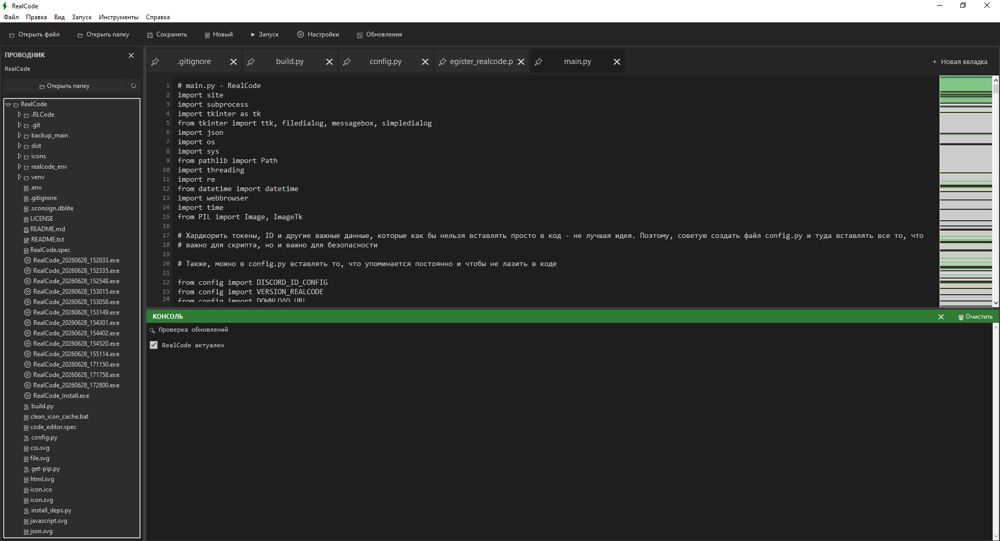

# RealCode — Легковесная IDE

## В чем ее плюсы:
1. Легкость -> Вместо 1 ГБ порой не нужной информации или лишних функций RealCode предлагает самый минимум для разработки.
2. Open Source -> Вместо строгой лицензии и кучи бумаг RealCode предлагает вам скачать исходный код и добавить то, чего лично вам не хватает, или выпустить свою IDE (лицензия MIT).
3. Разработана на Python -> Простой, но очень мощный язык программирования.
4. Поддержка разных языков программирования (скоро) -> Поддерживаются: Python, HTML, C, C++, HolyC, C#, CSS и JS (и его аналоги).
5. Занимает мало оперативной памяти и места на жестком диске -> Вместо тонны ненужных данных, забивающих ОЗУ и накопитель, RealCode предлагает очень легкую IDE для разработки мини-приложений или других проектов.
6. Спроектирована по типу VS Code -> Поэтому вам будет казаться, что вы где-то уже это видели...
7. Создана специально для инди-разработчиков и маленьких команд -> Специально для вас, друзья!

## Настройка:
1. При входе в IDE вас встретит крупное название RealCode и версия, а также список всех доступных горячих клавиш. Вместе с этим в вашей папке создается файл Settings.json — там хранятся все настройки и последние открытые файлы/папки.
2. Откройте папку или отдельный файл с помощью кнопок.Название проекта берется из названия папки.
3. В папке, на которую вы переключились, появляется каталог .RLCode. Там находятся все настройки проекта, а именно: закрепленные, последние открытые и все текущие файлы.RealCode — настройка исходников
4. С помощью команды ``git clone https://github.com/Kish-Mish122/RealCode .`` импортируйте проект в вашу рабочую папку.
5. Отредактируйте main.py и запустите код через ``python main.py`` (для проверки работы скрипта и наличия ошибок).
6. Для компиляции RealCode выполните ``python build.py`` -> это отдельный файл для сборки, вы можете изменять его под свои цели.
**Обязательно: соблюдайте пробелы. При наличии ошибок отступов в VS Code нажмите: CTRL+SHIFT+P -> Convert Indentation to Spaces.**

## config.py — в чем суть и польза
*Хардкодить токены, ID и другие важные данные в код - не лучшая идея. Если злоумышленники разберут ваш код, то они смогут использовать ваши токены в корыстных целях. В таких случаях вы можете создать отдельный файл с важными данными и значениями, а затем просто импортировать его для использования в коде.
Также его можно использовать для быстрого доступа к переменным, чтобы постоянно не искать их в коде.*
1. Создайте файл config.py через RealCode или другую IDE.Добавьте значение, которое вам важно или необходимо. Пример:
- DISCORD_ID_CONF=**********************
- VERSION_GITHUB=****
2. Добавьте в самый верх (после импортов): ``from config import НАЗВАНИЕ_ПЕРЕМЕННОЙ``.
3. Используйте в коде без риска взлома и других неприятных последствий.
  
**ОБЯЗАТЕЛЬНО: ЕСЛИ ВЫ БУДЕТЕ ВЫКЛАДЫВАТЬ ВАШУ IDE НА GITHUB/GITLAB И Д.Р., НЕОБХОДИМО ДОБАВИТЬ В ФАЙЛ .gitignore СТРОКУ config.py. ТАКЖЕ ТУДА МОЖНО ДОБАВИТЬ И ДРУГИЕ ФАЙЛЫ, КОТОРЫЕ НЕ НУЖНЫ В GIT-РЕПОЗИТОРИИ.**

# Приятного кодинга!
